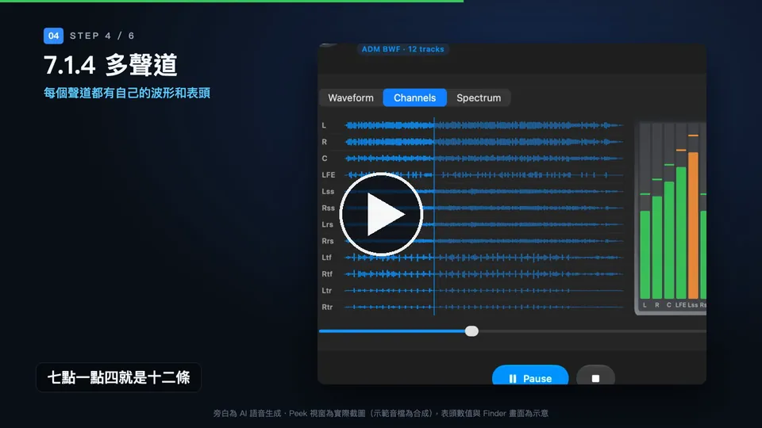
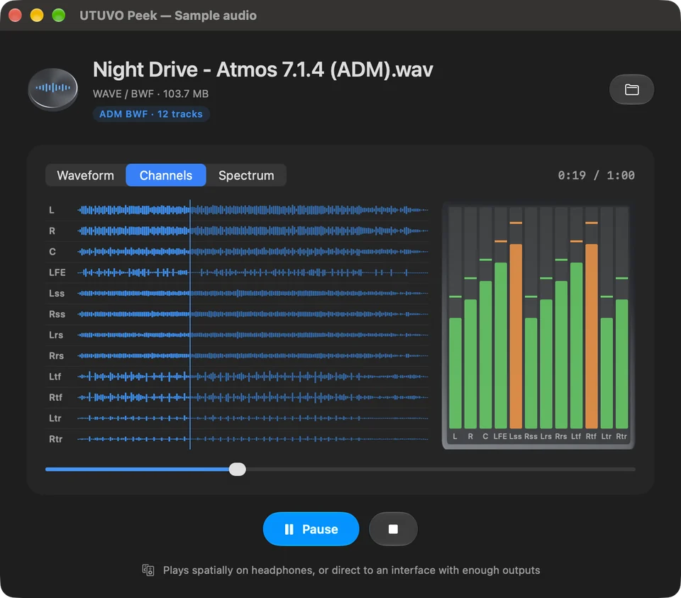
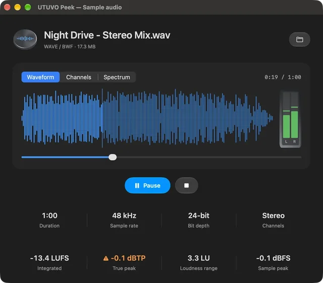
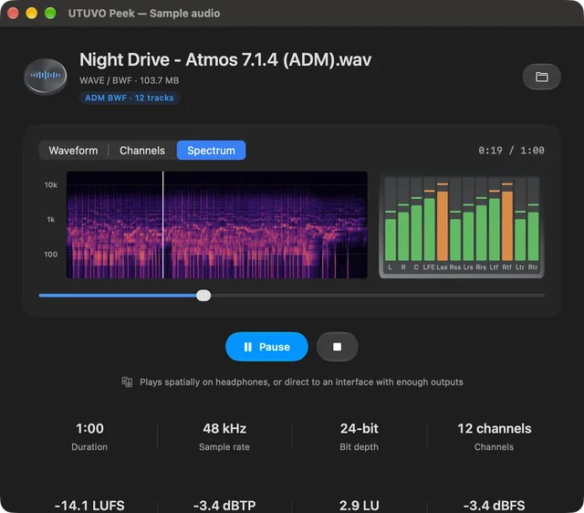
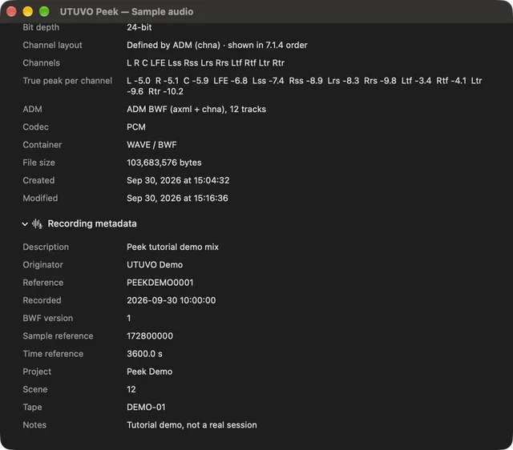

# UTUVO Peek

**在 Finder 選音檔、按空白鍵：看得到、聽得到、量得到。**
給交付音訊的人用的 macOS 原生 Quick Look 延伸功能——響度、True Peak、最多 7.1.4 的分軌波形與表頭，
還有檔案裡的 BWF／iXML／ADM 資訊。

[下載 Mac 版（Apple Silicon、macOS 14 以上）](https://github.com/mickyyang-1407/utuvo-peek/releases/latest) ·
[English](README.md) · 免費 · MIT 開源

▶ [看教學影片](https://mickyyang-1407.github.io/utuvo-peek/)（2:12，繁中旁白，5 MB）・原畫質在 [Release 附件](https://github.com/mickyyang-1407/utuvo-peek/releases/latest)

## 看得到什麼

- **響度**：ITU-R BS.1770-4 整合響度、EBU Tech 3342 響度範圍、超取樣 True Peak（96 kHz 以下 4×，逐聲道）與 Sample Peak。
  True Peak 超過 −1 dBTP 變橘色，到 0 變紅色。以 ffmpeg `ebur128` 交叉比對：粉紅噪音、5.1、44.1／48／96 kHz 測試檔誤差 ≤ 0.1 LU。
- **三種顯示**：Waveform（全部聲道）、Channels（每個喇叭一條，含標籤：5.1、7.1、7.1.2、7.1.4…）、
  Spectrum（對數頻率頻譜，20 Hz 到 Nyquist）。很小聲的檔案會放大顯示並標出放大量。
- **即時表頭**：播放時每個聲道的 Peak／平均值，Peak hold 1.5 秒。
- **播放**：預覽出現就開始播，關掉就停。多聲道檔案：介面輸出夠多就一對一直出，戴耳機就用 Apple HRTF 轉雙耳。
- **交付細節**：長度、取樣率、位元深度、聲道配置、編碼；BWF `bext`（描述、來源、時間碼）；
  iXML 專案／場次／Tape／備註；辨識 ADM BWF（`axml` + `chna`、軌數）、Dolby `dbmd` 與 RF64。

支援格式：WAV／BWF／RF64、AIFF、AIFF-C、CAF、FLAC、MP3、AAC／M4A。

| 立體聲混音 | 頻譜 | 細節 |
|---|---|---|
|  |  |  |

截圖使用合成的示範音檔；圖中表頭數值為固定示意。

## 安裝

1. 從 [Releases](https://github.com/mickyyang-1407/utuvo-peek/releases/latest) 下載 DMG，把 **UTUVO Peek** 拖到「應用程式」。
   App 以 Developer ID 簽章並經 Apple 公證。
2. 打開一次 UTUVO Peek 再關掉，讓 Finder 登記預覽功能。
3. 在 Finder 選一個音檔，按空白鍵。

如果 Finder 仍顯示系統預覽：系統設定 › 一般 › 登入項目與延伸功能 › Quick Look，確認 UTUVO Peek 已開啟。

## 隱私與資源

- 所有計算都在你的 Mac 上完成。不連網、沒有分析追蹤。
- Quick Look 延伸功能在系統沙盒內執行，只讀 Finder 交給它的那個檔案。
- 約 30 分鐘立體聲等量以內的檔案自動量響度；更長的檔案按 **Measure loudness** 才開始。
- 播放 12 聲道檔案時約佔一顆核心的 12 %（M 系列 Mac）；關掉預覽就不再佔用。

## 限制

- ADM 只辨識不渲染：不解析 `axml` 的物件，聲道以 bed 方式播放。
- 超過 24 個聲道只畫前 24 條。
- 耳機播放支援 3.0、Quad、5.1、7.1、7.1.2、7.1.4；其他聲道數需要輸出夠多的介面。
- BWF `bext` v1／v2 擴充欄位與常見標籤以外的 iXML 會略過。
- 沒有 Finder 縮圖延伸功能。

## 從原始碼建置

只用 Swift、SwiftUI、AppKit，沒有套件相依。建置、測試與簽章發布方式見 [README.md](README.md#build-from-source)。

## 授權

MIT，見 [LICENSE](LICENSE)。由 [UTUVO](https://utuvo.app) 製作。
